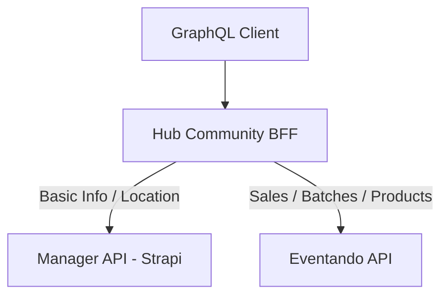

# Architecture: API Responsibilities and Data Flow

This document outlines the distinct responsibilities of the underlying APIs used by the BFF and how they are orchestrated.

## API Responsibilities

### Manager API

The Manager API is the source of truth for **basic information** and **structural content**.

- **Events**: Title, description, slug, dates, images.
- **Location**: Event locations and addresses.
- **Communities**: Community associations and details.
- **Talks & Speakers**: Schedule information, speaker bios, and avatars.
- **Tags**: Taxonomy and categorization.

> [!IMPORTANT]
> When fetching events from the Manager API, use the `populate` argument to retrieve nested relationships like `location` or `communities`.

### Eventando API (Manager Integration)

The Eventando API is the source of truth for **sales**, **transactional data**, and **batch management**.

- **Products**: Tickets and items for sale.
- **Batches**: Pricing tiers, quantities, and availability.
- **Sales/Signups**: User registrations and transactions.
- **Coupons**: Discount codes and validation.

## BFF Orchestration Layer

The BFF acts as a mediator, merging data from both sources to provide a unified GraphQL schema.

### Data Merging (e.g., `eventBySlugOrId`)

When retrieving a full event object, the BFF:

1.  Fetches base metadata from the **Manager API**.
2.  Fetches commercial data from the **Eventando API**.
3.  Merges the results, prioritizing the `uuid`/`id` link between them.

### Data Flow Pattern

